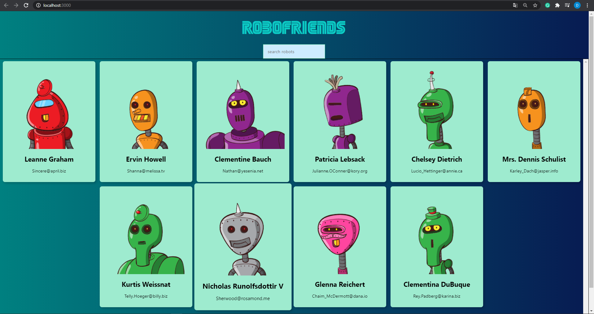
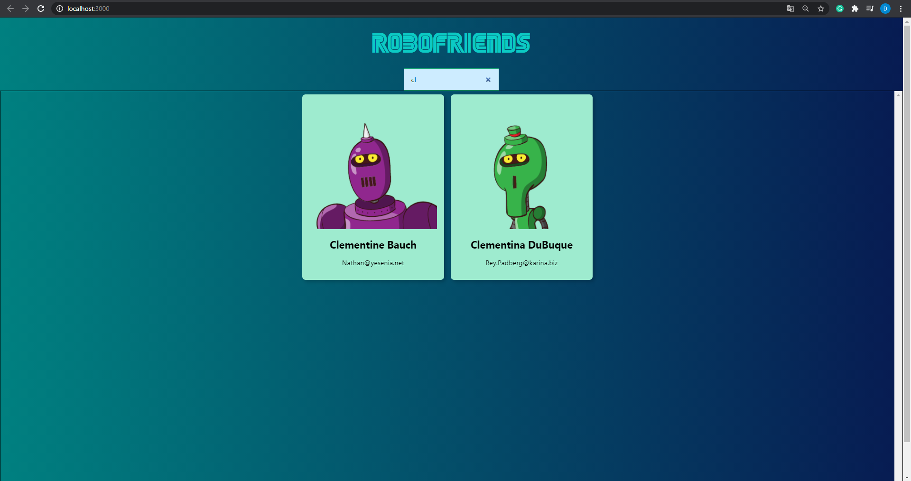
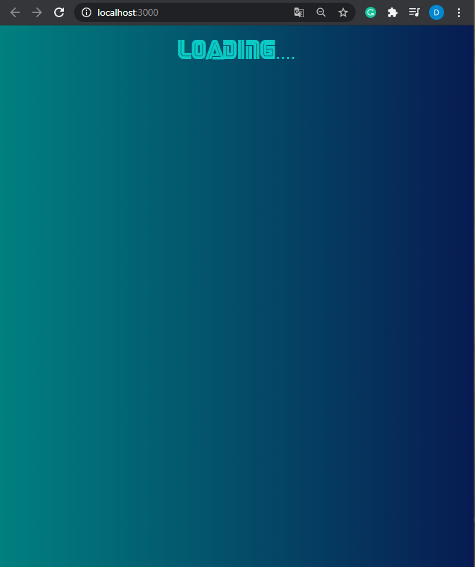

# The Robo Friends - react project

This project was bootstrapped with [Create React App](https://github.com/facebook/create-react-app).

## CodeStory

This project uses basic react/js/CSS/HTML principles to display a well ordered, responsive list of robot cards and search through it.

The data for this project:
- https://robohash.org/ - the robot pictures
- https://jsonplaceholder.typicode.com/users - using fetch(*link*) the app makes requests to display the fake users

 ## Demo:
  User Interface:
  
  - full page
  - 
  
  - search
  - 

  - smaller tab
  - 

  - loading
  - 
  
